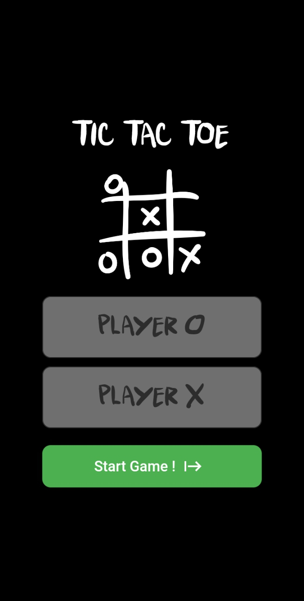
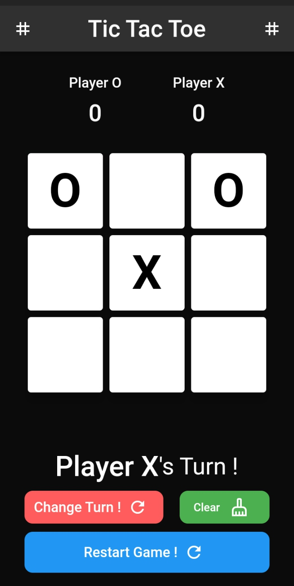

# TicTacToe Game

***Flutter*** for Frontend -
***Dart*** for Backend

TicTacToe Game that gives you an experience to play with your opponent and challenge them :)

## Getting started

>   _This Section will introduce you to the first Screen of TicTacToe_

### First Screen

_The game uses dark theme to avoid strain on your eyes, and it has an option to chose your name, as per convinience otherwise it will take the default option_

>Player X : you have an option to give its name otherwise Player X
>Player Y : you have an option to give its name otherwise Player Y

### Game Screen

_9 boxes are provided, turns are changed and can be changed although, it gives you a warning before changing the turn as it is not allowed but in extreme cases you can. Scoreboard is provided above to count the score which let you to identify the winning individual and the losing one._

>Change Turn : To change the Turn, from X to Y and vice versa
>Clear : To clear the 9 boxes only
>Restart Game : To clear the screen as well as set the above scores to 0

### Thanks for Visting here

Follow me on LinkedIn : https://www.github.com/hackbysarthak03

